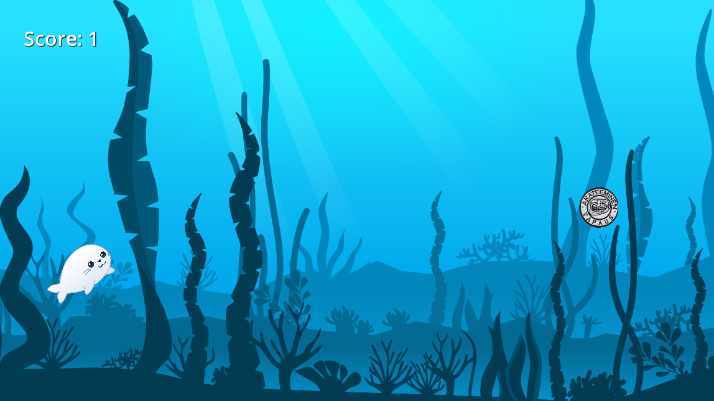
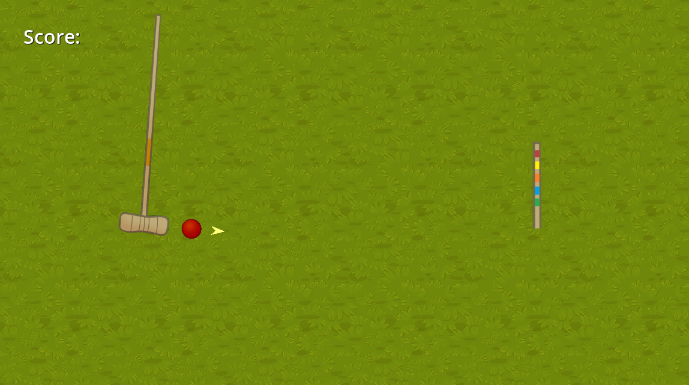
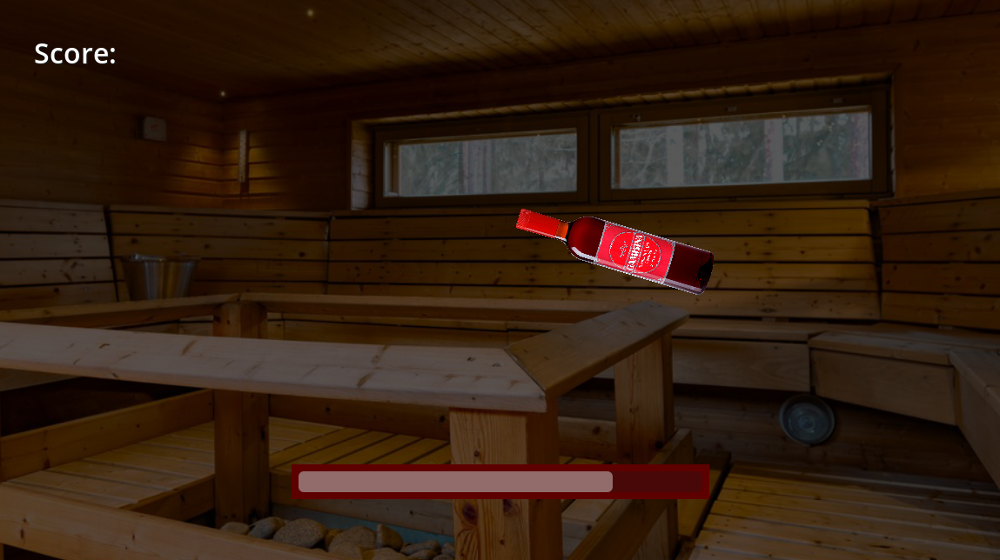

# Blanko minigames

This game was made by me in 24-hours at a game jam held during Blanko's LAN party in November of 2023.

The theme of the game jam was Blanko, which is the student guild of information processing science students at the University of Oulu.

This game won first place🥇

The game has 4 minigames that come one after another in random order. Each minigame is a small challenge and the player gets one point after completing a challenge. Game ends when the player fails in a minigame.

## Controls
Space.
(also, kurkkumopo can be moved left and right using the arrow keys)

## Screenshots

